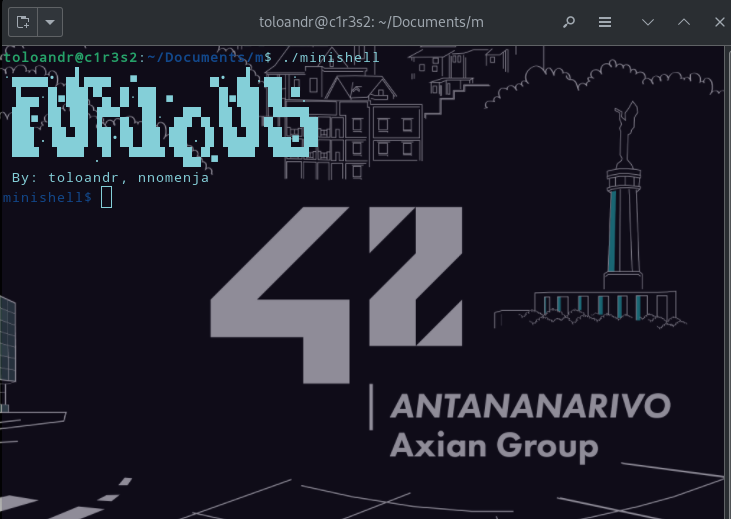
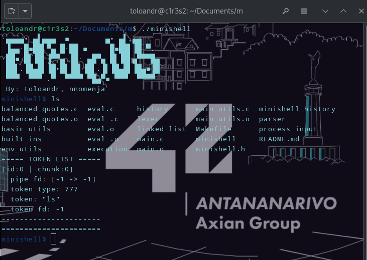
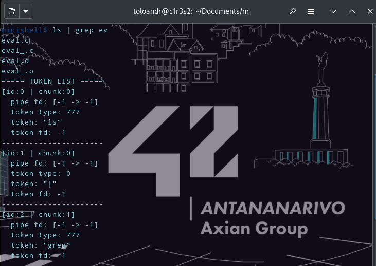
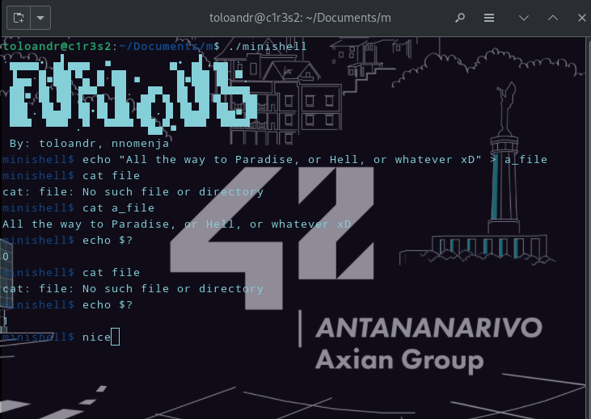

_This project has been created as part of the 42 curriculum by toloandr, nnomenja._

# Description
A shell program inspired by bash. Coded in C, including the readline library.

# Images
## Screenshots






# Instructions
## prerequisites
* C compiler plus the readline library
* build utils (make)

```bash
apt-get update && apt-get install -y build-essential make libreadline-dev
cd minishell
make
./minishell
```

# Project structure

```
|-- Makefile
|-- README.md
|-- balanced_quotes.c
|-- basic_utils
|   |-- basic_utils.h
|   |-- check_char.c
|   |-- fork_1.c
|   |-- ft_atoi.c
|   |-- ft_atol.c
|   |-- print_error.c
|   |-- put_str.c
|   |-- str_cat.c
|   |-- str_cmp.c
|   |-- str_cpy.c
|   |-- str_dup.c
|   |-- str_dup_delim.c
|   |-- str_len.c
|   |-- str_n_join.c
|   `-- str_tok.c
|-- built_ins
|   |-- built_ins.h
|   |-- cd.c
|   |-- echo.c
|   |-- env.c
|   |-- exit.c
|   |-- export.c
|   |-- export_utils_1.c
|   |-- export_utils_2.c
|   |-- pwd.c
|   `-- unset.c
|-- env_utils
|   |-- build_env_item.c
|   |-- cmp.c
|   |-- copy_dict.c
|   |-- create_env.c
|   |-- dict_add.c
|   |-- dictionary.h
|   |-- env_utils.c
|   |-- free_dict.c
|   |-- get_item.c
|   |-- sort_dict.c
|   |-- sort_env.c
|   |-- split_env_item.c
|   `-- system_env_to_dict.c
|-- eval.c
|-- eval_.c
|-- execution
|   |-- build_cmd.c
|   |-- execution.h
|   |-- is_built_in.c
|   |-- is_directory.c
|   |-- is_executable.c
|   |-- is_path.c
|   |-- run_cmd.c
|   |-- run_cmds.c
|   |-- run_cmds_utils_1.c
|   |-- run_cmds_utils_2.c
|   |-- run_cmds_utils_3.c
|   `-- run_redirs.c
|-- history
|   |-- history.h
|   |-- init_history.c
|   `-- utils_history.c
|-- lexer
|   |-- check_tokens.c
|   |-- expand_var_envs.c
|   |-- expand_var_envs_1.c
|   |-- is_operator.c
|   |-- lexer.c
|   |-- lexer.h
|   |-- remove_quotes.c
|   |-- tag_all.c
|   `-- tag_quotes.c
|-- linked_list
|   |-- free_list.c
|   |-- list.h
|   |-- list_append.c
|   |-- remove_head.c
|   `-- remove_tail.c
|-- main.c
|-- main_utils.c
|-- minishell.h
|-- parser
|   |-- heredoc.c
|   |-- heredoc_utils.c
|   |-- parser.c
|   `-- parser.h
`-- process_input
    |-- exit_status.c
    |-- process_input.h
    |-- spacing.c
    |-- spacing_utils_1.c
    `-- spacing_utils_2.c

```

# Details of implementation

The main objective of this project is to execute commands via `execve`, which optionally needs environment variables.

All the data needed for the program to work is stored in **t_list** in **linked_list/list.h**, in the first node.

The program follows the **REPL** standard (**R**ead **E**val **P**rint **L**oop).

> Read

The read part is handled by **new_input** in **process_input/spacing.c**.

It checks for unclosed quotes, adds spaces around operators, and expands the exit status via `$?`.

> Eval & Print

The eval part is in the function **eval** in **eval.c**.

The function **preprocess_tokens** is responsible for expanding environment variables and acts as the main tokenizer by calling **lexing** from **lexer/lexer.c**, and is completed by **process_tokens** in **eval_.c**, which removes quotes, tags all remaining tokens, and splits the tokens with a pipe `'|'` as a separator, which is just making the **next_** member of **t_list** NULL.

If there are **heredocs**, the **run_heredocs** function takes care of them.

And finally, the print part happens when the **run_cmds** function from **execution/run_cmds.c** uses pipes created in **split_tokens**, used via **process_tokens**, to execute each 'chunk' that was split.

At the same time, each input is added to a file **'minishell_history'** via **add_history_** used in **main.c**.

> Loop

# Debug

Uncomment the function **print_token_list** in **eval.c** to see every node of **'tokens'**.

# Authors

* [nnomenja](https://www.linkedin.com/in/mamenosoa)
* [toloandr](https://www.linkedin.com/in/toloandr/)
